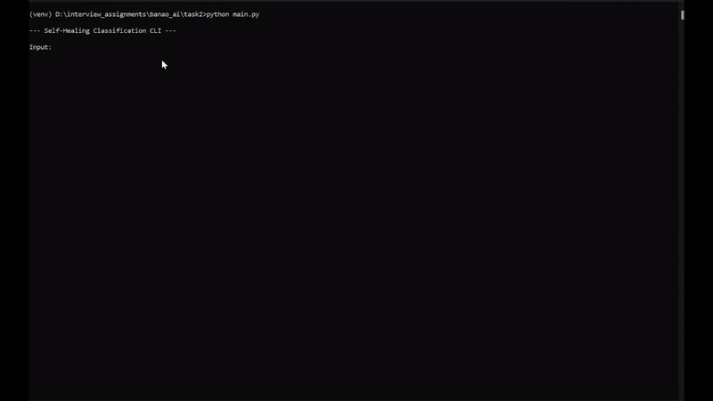
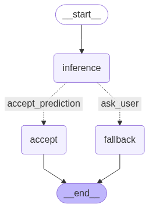

# Self-Healing Classification DAG with Fine-Tuned Model

**Author:** Vaishnav Mankar

<!-- **Video Walkthrough:** [Link to your Loom/YouTube video] -->

---

## 🚀 Live Demo

This project in action, demonstrating both a high-confidence prediction and a low-confidence fallback to a zero-shot model.



---

## 🏛️ Architecture

The application is built as a stateful graph using LangGraph. The graph orchestrates the flow of data between the primary model, a confidence check, and a fallback model.



---

## ✨ Key Features

- **Fine-Tuned Primary Model:** `distilbert-base-uncased` fine-tuned on the `sst2` dataset using PEFT/LoRA for efficient training.
- **Self-Healing Fallback:** If the primary model's confidence is below 90%, the system automatically uses a `facebook/bart-large-mnli` zero-shot model as a robust backup.
- **Structured Logging:** All events are logged to `log_file.log` with timestamps and severity levels for easy debugging.
- **Clean Architecture:** The application logic is separated by concern into `src/model_loader`, `src/graph_builder`, and `src/logger_setup`.

---

## ⚙️ How to Run

1.  **Clone the Repository:**
    ```bash
    git clone https://github.com/myselfmankar/Assignments_Interview.git
    cd banao_ai/task2
    ```

2.  **Create a Virtual Environment & Install Dependencies:**
    ```bash
    python -m venv venv
    source venv/bin/activate # On Windows: venv\Scripts\activate
    pip install -r requirements.txt
    ```

3.  **Set Up Environment Variables:**
    *   Create a `.env` file in the root directory. You can copy `.env.example`.
    *   Add your Hugging Face Hub access token to this file: `HUGGING_FACE_HUB_TOKEN="hf_YOUR_TOKEN_HERE"`

4.  **Run the Application:**
    ```bash
    python src/main.py
    ```

---

## 🧠 Model Fine-Tuning

The primary model is a fine-tuned adapter available on the Hugging Face Hub.

- **Hub Link:** [myslefmankar/distilbert-base-sst2-lora](https://huggingface.co/myselfmankar/distilbert-base-sst2-lora)
- **Training Process:** The complete fine-tuning process, performed in Google Colab, is documented in the following notebook:
  - [`notebooks/fine_tune_distilbert.ipynb`](notebooks/fine_tune_distilbert.ipynb)
