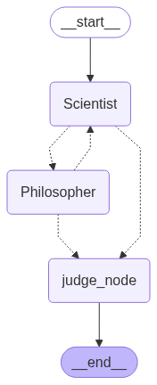

# LangGraph Multi-Agent Debate Simulation

**Author:** Vaishnav Mankar

**Video Walkthrough:** [Youtube](https://youtu.be/xI6YNZ6UMhc)
---


## 🚀 Demo

A demonstration of the application's command-line interface in action:


---

## 🏛️ Architecture

The application is structured as a Directed Acyclic Graph (DAG) using LangGraph. Each node represents an agent (Scientist, Philosopher, Judge), and edges control the debate flow and transitions.



---

## ✨ Key Features

- **Interactive CLI:** Specify any debate topic at runtime.
- **Distinct Agent Personas:** Scientist (evidence-based) and Philosopher (logic/ethics).
- **Structured Debate Flow:** 8 rounds (4 arguments per agent), strictly enforced.
- **Stateful Memory:** Full conversation history for agent context.
- **Conditional Routing:** LangGraph's conditional edges manage debate rounds and judge transition.
- **Automated Judgment:** Judge agent summarizes and declares a winner with justification.
- **Comprehensive Logging:** All transitions, outputs, and verdicts logged for traceability.

---

## 📁 Project Structure

```
langgraph-debate-project/
├── logs/
│   └── debate_log.txt        # Auto-generated debate logs; overwrites log file on each run
├── main.py                   # Entry point: CLI and runner
├── graph_setup.py            # LangGraph state, nodes, and graph
├── prompts.py                # Agent and judge prompt templates
├── requirements.txt          # Python dependencies
```

---

## ⚙️ Setup and Installation

1. **Clone the Repository:**
    ```bash
    git clone [your-github-repository-url]
    cd langgraph-debate-project
    ```

2. **Create and Activate a Virtual Environment:**
    ```bash
    python -m venv venv
    source venv/bin/activate  # On Windows: venv\Scripts\activate
    ```

3. **Install Dependencies:**
    ```bash
    pip install -r requirements.txt
    ```

4. **Set Up API Key:**
    - Create a `.env` file in the root directory.
    - Add your Google AI API key:
      ```
      GOOGLE_API_KEY="your-api-key-goes-here"
      ```

---

## ▶️ How to Run

Start the debate simulation from your terminal:

```bash
python main.py
```

