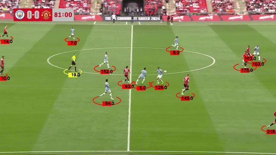

# Player and Ball Tracking System

This project implements a video tracking system for detecting and tracking players, referees, and balls in sports videos using YOLO and custom tracking algorithms.

## Setup

### Prerequisites
- Python 3.11 or above
- GPU (recommended for optimal performance)

### Installation

1. Clone the repository:
```bash
git clone <repository-url>
cd liat_ai
```

2. Create and activate a virtual environment (optional but recommended):
```bash
python -m venv venv
# On Windows
venv\Scripts\activate
# On Linux/Mac
source venv/bin/activate
```

3. Install dependencies:
```bash
pip install -r requirements.txt
```

### Project Structure
```
ReID-Single-Feed/
├── main.py                 # Main entry point
├── tracker/
│   └── tracker.py         # Tracking implementation
├── utils/
│   └── video_utils.py     # Video processing utilities
├── custom_botsort.yaml    # Tracker configuration
└── requirements.txt       # Project dependencies
```

## Usage

1. Place your YOLO model file in the project directory
2. Update the following paths in `main.py`:
   - `CUSTOM_MODEL_PATH`: Path to your YOLO model file
   - `VIDEO_PATH`: Path to input video file
   - `OUTPUT_PATH`: Desired output video location

3. Run the tracker:
```bash
python main.py
```

## Configuration

The tracking system can be configured using `custom_botsort.yaml`. Key parameters include:
- `track_high_thresh`: High confidence threshold (0.25)
- `track_low_thresh`: Low confidence threshold (0.1)
- `match_thresh`: Matching threshold for tracking (0.8)
- `with_reid`: Enable/disable ReID features (True)

## Output

The system generates:
- Annotated video with tracked objects
- Players marked with red ellipses and ID numbers
- Referees marked with yellow ellipses and ID numbers
- Ball marked with green triangles

**Output Video:**  
You can view the results of the tracking system in the following video:

[](output_video/output_tracked_video.mp4)

This video demonstrates the assignment of IDs to players, referees, and the ball throughout the sample clip.

## Caching

The system supports caching of tracking results using the `stub_path` parameter to avoid reprocessing videos. Enable this by setting `read_from_stub=True` in `main.py`.
